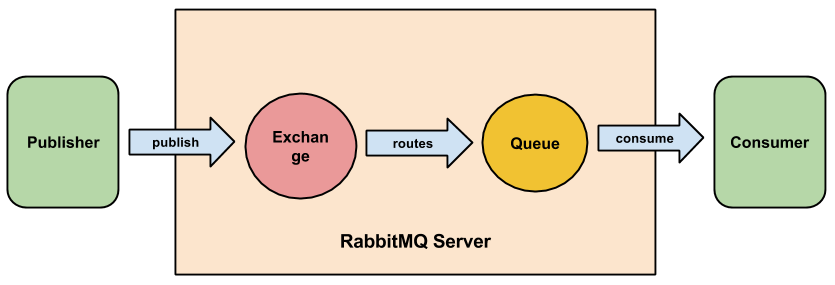
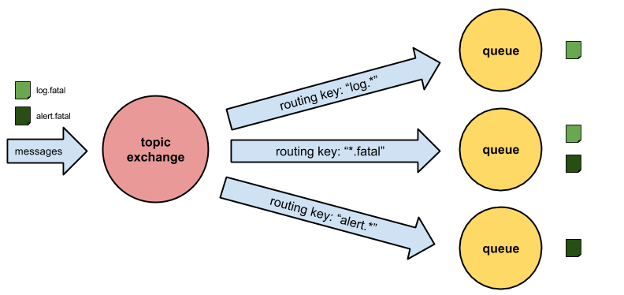

## AMQP Model
  
### AMQP connections
To send a message to the RabbitMQ broker a producer application first has to create a AMQP connection to the broker. AQMP is an application level protocol that uses TCP for reliable delivery. AMQP connections use authentication and can be protected with SSL.

As some applications may need multiple connections to the broker it is possible to create one or more AMQP channels within a single connection. These channels are virtual connections inside a TCP connection with an unique ID. 

There are some good reason why this way of sending messages over an virtual connection instead of sending it directly via TCP is good.

Setting up and tearing down TCP connection for every each message is very expensive for an operating system. Another point is that your operating system can only build a specific number of TCP connections per seconds so that you will hit a performance wall soon.

With RabbitMQ you can create hundreds of thousands of channels a second and send messages (with specific label) from one endpoint to another.

The following example demonstrates how to create a connection and a channel to the broker, doesn't matter if you are a building a producer or consumer:

	ConnectionFactory factory = new ConnectionFactory();
	factory.setHost("localhost");
	Connection connection = factory.newConnection();
	Channel channel = connection.createChannel();

### Overview
We are now able to connect our producer and consumer to the broker. But how can we send messages?

Before we send messages we need to understand the basic concept of the AQMP-Model.

Producers publish their messages to *exchanges*. *Queues* are where the messages end up and are received by consumers. *Bindings* are some kind of rules which define how the messages get routed from the *exchange* to particular *queues*.

### Exchanges
Exchanges take a message and route it into zero or more queues. The routing algorithm is based on the exchange type and the given *binding* (through a routing key). Therefore when you send a message to the broker, it will have a routing key - even a blank one - which RabbitMQ try to match to the routing keys used in the bindings.

There are four different types of exchanges: direct, fanout, topic and headers. We will cover the first three here in detail. 

#### Direct exchange

A direct exchange delivers messages to queues based on the message routing key.

So lets assume we have a queue Q which is bound to an exchange E by an routing key K. When a message arrives at direct exchange E with the routing key N it will be routed to the queue Q if N = K.

Direct exchanges are often used to distribute tasks between multiple workers in a round robin manner. The messages will then be load balanced between the consumers.

Here is an example of how to create a direct exchange with name "hello":

	String exchangeName = "test";
	String exchangeType = "direct";
	channel.exchangeDeclare(exchangeName, exchangeType);

#### Fanout exchange

A fanout exchange broadcasts a message to all bound queues while completely ignoring the routing key. We can think of an fanout exchange as a radio station.
 

This exchange is useful if an application has to to multiple operations triggered by one action. For example when a user sends name and password to our system, we not only want to log him in, but also do some loggint to database and increase some visitor counter. We could do so by binding three queues to the fanout exchange. Each of them will then receive the message (with the username and password inside) and can do the specific work.

Here is an example how to declare a fanout exchange:
   
	String exchangeName = "hello";
	String exchangeType = "fanout";
	channel.exchangeDeclare(exchangeName, exchangeType);

#### Topic exchange

The topic exchange is the most complex and powerful of the three described exchanges. With this complexity it can be used in a lot of different cases. 

The message is routed based on the message routing key and the queue routing pattern (regex based), which is defined while binding the queue to the exchange. 

As we can see in the example above lets assume there are two messages arriving at the exchange with a specific routing key ("log.fatal", "alert.fatal"). The routing key of the first message "log.fatal" is matching routing pattern of the first ("log.\*") and the second ("\*.fatal") binding and is therefore delivered to queue one and two. 

As the routing key of the second message ("alert.fatal") is matching the routing keys of the second ("\*.fatal") and the third ("alert.\*") binding, it gets delivered to queue two and three.

Here is an example of how to create a topic exchange:
	
	String exchangeName = "world";
	String exchangeType = "topic";
	channel.exchangeDeclare(exchangeName, exchangeType);

If there are no special characters like "\*" or "#" used in the binding, the topic exchange will behave just like a direct exchange.

### Queues
As we were talking about queues a lot during this chapter we will now have a closer look at them.

Queues can be created by both consumer and producer by using `channel.queueDeclare()`. While creation it is possible to give a name to the queue or let the server auto-generate one for you.

	// declare a server-named queue
	channel.queueDeclare();

	// declare queue with custom name
	String queueName = "nameOfQueue";
	channel.queueDeclare(queueName, false, true, false, null);

A consumer can register to a queue by using `channel.basicConsume()`:

	QueueingConsumer consumer = new QueueingConsumer(channel);
	String queueName = "nameOfQueue";
	channel.basicConsume(queueName, true, consumer);

To receive a single message from the queue the consumer then calls `consumer.nextDelivery()`. To constantly listen for new messages you should wrap the call into an infinite loop:

	while(true) {
		QueueingConsumer.Delivery delivery = consumer.nextDelivery();
		String message = new String(delivery.getBody());
		System.out.println("received: " + message);
	}

If there are no consumers for a queue, the messages will remain in the queue until a new consumer is subscribing to the queue.

### Bindings
We described how to create different types of exchanges and how to setup and read from queues. But one part is missing: Bindings. 

Bindings are rules that exchanges use to route messages to queues. To route a message from an exchange to a queue, the queue has to be bound to the exchange. 

Bindings may have an routing key, which is used by some exchange types to filter messages before sending them to the matching bound queue(s).

Here is an example of how to bind an queue to an exchange:
	
	String exchangeName = "nameOfExchange";

	// declare an exchange
	String exchangeType = "topic";
	channel.exchangeDeclare(exchangeName, exchangeType);

	// declare a server-named queue
	String queueName = channel.queueDeclare().getQueue();
	
	// define a binding key and bind the queue to the exchange
	String bindingKey = "*.fatal";
	channel.queueBind(queueName, exchangeName, bindingKey);

	// define a routing key and publish a message to the exchange
	String message = "Hello World";
	String routingKey = "log.fatal"; 
	channel.basicPublish(exchangeName, routingKey, null, message.getBytes());