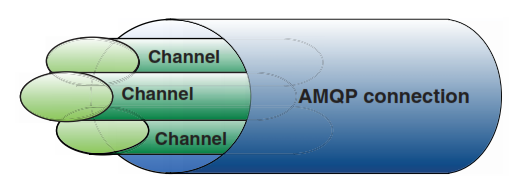
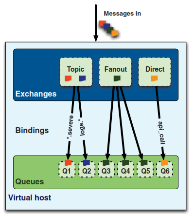
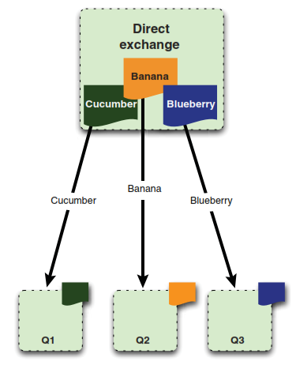
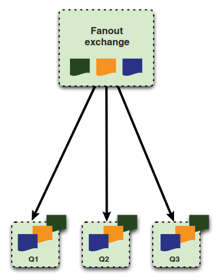
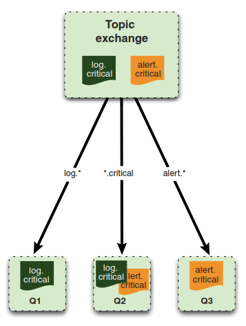

## Description

* publish / subscribe

### Advanced Message Queuing Protocol (AMQP)
* wire-level protocol
* open-standard application layer protocol
* from iMatix Corporation
* 

### AMQP connections
To send a message to the RabbitMQ Server/Broker you first have to create a TCP connection to it.
Once the TCP connection is open your application then creates an AMQP channel. This channel is a virtual connection inside the TCP connection with an unique ID.

There are some good reason why this way of sending messages over an virtual connection instead of sending it directly via TCP is good:

Setting up and tearing down TCP connection for every each message is too expensive for an operating system. Next thing is that your operating system can only build a specific number of TCP connections per seconds so that you will hit a performance wall soon.

With RabbitMQ you can create hundreds of thousands of channels a second and send messages (with specific label) from one endpoint to another.

### AMQP stack: exchanges, bindings, queues

The exchanges are where producers publish their messages, queues are where the messages end up and are received by consumers, and bindings are how the messages get routed from the exchange to particular queues.

#### Queues
* consumer and producer can create queues by queue.declare()
* consumer can subscribe to a queue.
* use basic.consume to register to a queue
* use basic.get to receive a single message from queue
* if there are no consumers for a queue the messages will wait in queue and be send if a consumer is subscribing to the queue
* if there are multiple consumers registered to the queue the messages are served in a round.robin fashion. Therefore each message is sent to only one consumer.
* Every Message that's received by a consumer is required to be acknowledged (basic.ack() or auto_ack) to RabbitMQ (not to producer)

#### Exchanges and Bindings

* How does a message reach a queue?
* Whenever you want to deliver a message to a queue, you do it by sending it to an exchange
* Based on certain rules (routing keys) RabbitMQ will decide to which queue it should deliver the message

##### exchange types (routing algorithms)

Based on the message routing key and the exchange type, the broker will decide to which queue it has to deliver the message

**direct exchange**

**fanout exchange**

* multicasting message to all bound queues
 

**topic exchange**

* regex based routing keys to adress multiple queues

### Virtual Hosts
* mini-RabbitMQ server with own
	* queues
	* exchanges
	* bindings
	* permissions
* safely use one RabbitMQ server for multiple applications
* minimum one vhost per server (default)
* rabbitmqctl add_vhost [name]
* rabbitmqctl delete_vhost [name] 

### persistence
* normally queues and exchanges and therefore also messages will not survive reboot of RabbitMQ server
* to make a message survive a crash of the AMQP broker you have to follow some steps:
	* flag message as persistent by setting delivery mode to 2 (persistent)  
	* message must be published to an exchange that*s durable and
	* message arrive in queue that is durable
* RabbitMQ will achieve persistence by writing message to disk
* price: performance

### Configuration

[http://www.rabbitmq.com/configure.html](http://www.rabbitmq.com/configure.html)

### Administration
- [Management](http://www.rabbitmq.com/management.html "Management")
- [Managment Command Line Tool](http://www.rabbitmq.com/management-cli.html)
- [Management HTTP API](http://hg.rabbitmq.com/rabbitmq-management/raw-file/rabbitmq_v3_1_5/priv/www/api/index.html)
