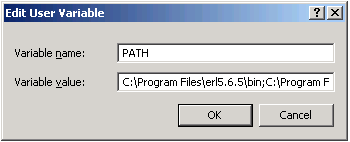
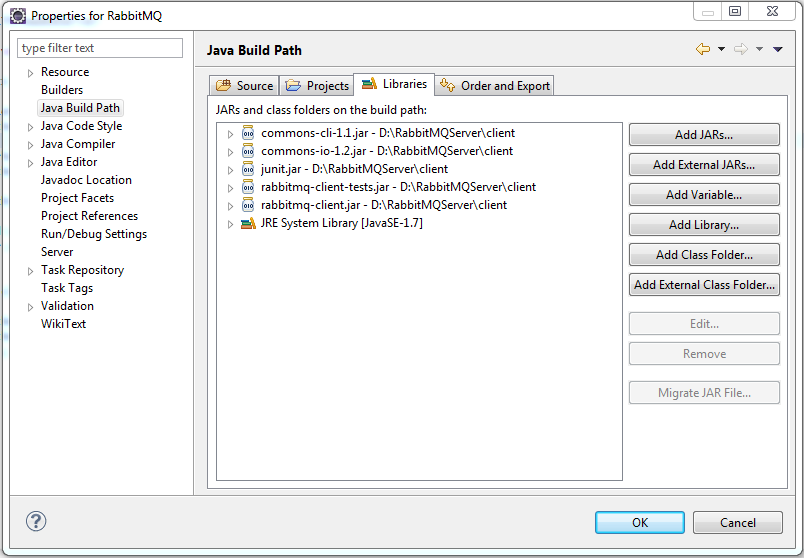
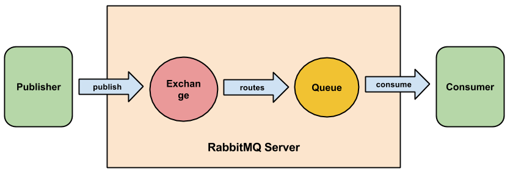
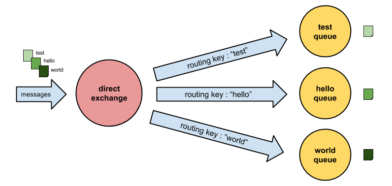
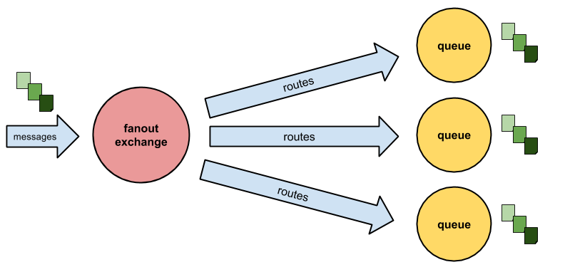
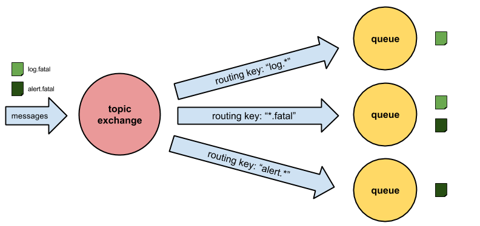
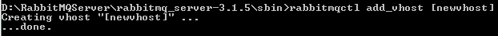
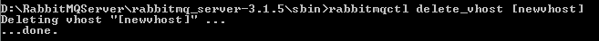

# RabbitMQ

## Introduction

RabbitMQ is a open source message broker written in Erlang. 

It lets application share data via a common protocol (AMQP) or simply queue jobs for processing by distributed workers. It lets you decouple your applications and easily add more components (like workers). 

RabbitMQ is, except Qpid, the only message broker, which is based on the Advanced Message Queuing Protocol. 

### Advanced Message Queuing Protocol

The Advanced Message Queuing Protocol (AMQP) is a networking protocol that enables applications (clients) to connect to and communicate with messaging brokers. 

Messaging brokers receive messages from publishers / producer and route them, based on specific rules, to consumers. 

We can think of an messaging broker as a delivery service, focused on application to application messaging. 

A message broker acts like a router between applications. It decouples producer and consumer in such a way that both of them do not even have to know each other. 

Unlike TCP for example there is no exchange of (IP) addresses or routing information. 

### Messages
Messages published to a AQMP message broker consists, besides a handful of flags, of two parts: A payload (the data you want to send) and a label.
 
The payload is not interpreted nor changed by the broker and the format is up to the producer of the message. It is common to use serialization formats like JSON to serialize structured data in order to publish it as the message payload.
 
The label describes the payload and also may get interpreted by the broker to determine who should get a copy of the message.

The consumer in turn will then only receive the payload. No label. It is like receiving a letter wrapped in a blank envelope. 

### Hello World example
To gain an fast overview how a Java program, using RabbitMQ, may look like, we will walk through a "Hello World" example. 

#### Producer

	import java.io.IOException;
	
	import com.rabbitmq.client.Channel;
	import com.rabbitmq.client.Connection;
	import com.rabbitmq.client.ConnectionFactory;
	
	public class HelloWorldProducer
	{
	    private final static String QUEUE_NAME = "hello";
	
	    public static void main(String[] argv) throws IOException
	    {
			// create a connection and a channel to RabbitMQ server
			ConnectionFactory factory = new ConnectionFactory();
			factory.setHost("localhost");
			Connection connection = factory.newConnection();
			Channel channel = connection.createChannel();
		
			// declare a queue with name "hello"
			// this can to be done by producer or consumer
			channel.queueDeclare(QUEUE_NAME, false, false, false, null);
		
			// send the message to the RabbitMQ server
			String message = "Hello World!";
			channel.basicPublish("", QUEUE_NAME, null, message.getBytes());
			System.out.println(" [x] Sent '" + message + "'");
		
			// close connection
			channel.close();
			connection.close();
	    }
	}

#### Consumer

	import com.rabbitmq.client.Channel;
	import com.rabbitmq.client.Connection;
	import com.rabbitmq.client.ConnectionFactory;
	import com.rabbitmq.client.QueueingConsumer;
	
	public class HelloWorldConsumer
	{
	    private final static String QUEUE_NAME = "hello";
	
	    public static void main(String[] argv) throws java.io.IOException, java.lang.InterruptedException
	    {
			// create a connection and a channel to RabbitMQ server
			ConnectionFactory factory = new ConnectionFactory();
			factory.setHost("localhost");
			Connection connection = factory.newConnection();
			Channel channel = connection.createChannel();
			
			// declare a queue with name "hello" 
			// this can to be done by producer or consumer
			channel.queueDeclare(QUEUE_NAME, false, false, false, null);
		
			// create a consumer and subscribe to queue
			QueueingConsumer consumer = new QueueingConsumer(channel);
			channel.basicConsume(QUEUE_NAME, true, consumer);
		
			System.out.println(" [*] Waiting for messages. To exit press CTRL+C");
		
			while (true)
			{
				// receive next message from queue
			    QueueingConsumer.Delivery delivery = consumer.nextDelivery();
			    String message = new String(delivery.getBody());
			    System.out.println(" [x] Received '" + message + "'");
			}
	    }
	}

Producer and Consumer first have to create a connection and channel to RabbitMQ Server. Through this connection and channel it is then possible for the clients to declare queues on the server and to send messages to and receive message from this queues.

## Installation

The chapter will describe how to install RabbitMQ on different platforms including Windows and Linux. As RabbitMQ Server is based on Erlang we first have to download, install and configure Erlang for the specific platform.

### Erlang Installation

#### Linux

##### Installing from source package

First you have to install some dependencies Erlang has:

	sudo apt-get install build-essential
	sudo apt-get install libncurses5-dev 
	sudo apt-get install openssl 
	sudo apt-get install libssl-dev
	sudo apt-get install fop 
	sudo apt-get install xsltproc 
	sudo apt-get install unixodbc-dev

After you installed the required dependency packages you can download the latest version of Erlang, unzip and build it:

	wget http://erlang.org/download/otp_src_R15B01.tar.gz
	tar zxvf otp_src_R15B01.tar.gz
	cd otp_src_R15B01
	./configure 
	make 
	sudo make install

##### Ubunutu

On ubuntu platform it is very easy to install Erlang. Just open a terminal, type in the following and press enter: 

	sudo apt-get install erlang

#### Windows

Download Erlang Windows Installer from *Download* section of Erlang's homepage (http://www.erlang.org/download.html) and install it by following the instructions.

Then you should add the installation path of Erlang (up to the bin folder) to the *PATH* enviroment variable. You can do so by navigating to "*Control Panel > System and Security > System Properties > Advanced > Environment Variables > User Variables*" and editing the described entry.

### RabbitMQ Server Installation

#### Windows

##### With Installer
Download the RabbitMQ Installer for Window systems from the Download section (http://www.rabbitmq.com/download.html) and install it. It will setup the RabbitMQ server as an service with default configuration.
The server will be started on windows start.

##### Manual
Download RabbitMQ Server .zip-File from Download section of RabbitMQ homepage (http://www.rabbitmq.com/download.html), unzip it and place the content of *rabbitmq_server-XXX* folder in some suitable directory.

To get the server started you can run *rabbitmq-server.bat* in *sbin* directory. To manage the service and start the broker you should run *rabbitmq-service.bat*.

#### Linux (Ubuntu / Debian)
The RabbitMQ server is included in Debian (> Version 6.0) and Ubuntu (> Version 9.04). But as these included versions are often old, it will probably be better to install current version from RabbitMQ homepage.

One way to do this is to go to download section of RabbitMQ homepage (http://www.rabbitmq.com/download.html), download the .deb-file and install it.

Another possibility is to use RabbitMQ APT repository:
	
	deb http://www.rabbitmq.com/debian/ testing main
	wget http://www.rabbitmq.com/rabbitmq.com/rabbitmq-signing-key-public.asc
	sudo apt-key add rabbitmq-signing-key-public.asc
	apt-get update
	sudo apt-get install rabbitmq-server

### Official Clients
The RabbitMQ community has created a large number of clients in different languages such as Java, C, Clojure,  Ruby, Python, PHP, Perl and many more. 

As we are making use of Java Programming language in this book, we will demonstrate where to download and how to use the Java client.

First you have to download the RabbitMQ  Java Client from Download section (http://www.rabbitmq.com/download.html). 

Unzip the archive and put the jar files into your classpath.
If you are using Eclipse you should add the jar-Files into Java Build Path of your project.

## AMQP Model
  
### AMQP connections
To send a message to the RabbitMQ broker a producer application first has to create a AMQP connection to the broker. AQMP is an application level protocol that uses TCP for reliable delivery. AMQP connections use authentication and can be protected with SSL.

As some applications may need multiple connections to the broker it is possible to create one or more AMQP channels within a single connection. These channels are virtual connections inside a TCP connection with an unique ID. 

There are some good reason why this way of sending messages over an virtual connection instead of sending it directly via TCP is good.

Setting up and tearing down TCP connection for every each message is very expensive for an operating system. Another point is that your operating system can only build a specific number of TCP connections per seconds so that you will hit a performance wall soon.

With RabbitMQ you can create hundreds of thousands of channels a second and send messages (with specific label) from one endpoint to another.

The following example demonstrates how to create a connection and a channel to the broker, doesn't matter if you are a building a producer or consumer:

	ConnectionFactory factory = new ConnectionFactory();
	factory.setHost("localhost");
	Connection connection = factory.newConnection();
	Channel channel = connection.createChannel();

### Overview
We are now able to connect our producer and consumer to the broker. But how can we send messages?

Before we send messages we need to understand the basic concept of the AQMP-Model.

Producers publish their messages to *exchanges*. *Queues* are where the messages end up and are received by consumers. *Bindings* are some kind of rules which define how the messages get routed from the *exchange* to particular *queues*.

### Exchanges
Exchanges take a message and route it into zero or more queues. The routing algorithm is based on the exchange type and the given *binding* (through a routing key). Therefore when you send a message to the broker, it will have a routing key - even a blank one - which RabbitMQ try to match to the routing keys used in the bindings.

There are four different types of exchanges: direct, fanout, topic and headers. We will cover the first three here in detail. 

#### Direct exchange

A direct exchange delivers messages to queues based on the message routing key.

So lets assume we have a queue Q which is bound to an exchange E by an routing key K. When a message arrives at direct exchange E with the routing key N it will be routed to the queue Q if N = K.

Direct exchanges are often used to distribute tasks between multiple workers in a round robin manner. The messages will then be load balanced between the consumers.

Here is an example of how to create a direct exchange with name "hello":

	String exchangeName = "test";
	String exchangeType = "direct";
	channel.exchangeDeclare(exchangeName, exchangeType);

#### Fanout exchange

A fanout exchange broadcasts a message to all bound queues while completely ignoring the routing key. We can think of an fanout exchange as a radio station.
 

This exchange is useful if an application has to to multiple operations triggered by one action. For example when a user sends name and password to our system, we not only want to log him in, but also do some loggint to database and increase some visitor counter. We could do so by binding three queues to the fanout exchange. Each of them will then receive the message (with the username and password inside) and can do the specific work.

Here is an example how to declare a fanout exchange:
   
	String exchangeName = "hello";
	String exchangeType = "fanout";
	channel.exchangeDeclare(exchangeName, exchangeType);

#### Topic exchange

The topic exchange is the most complex and powerful of the three described exchanges. With this complexity it can be used in a lot of different cases. 

The message is routed based on the message routing key and the queue routing pattern (regex based), which is defined while binding the queue to the exchange. 

As we can see in the example above lets assume there are two messages arriving at the exchange with a specific routing key ("log.fatal", "alert.fatal"). The routing key of the first message "log.fatal" is matching routing pattern of the first ("log.\*") and the second ("\*.fatal") binding and is therefore delivered to queue one and two. 

As the routing key of the second message ("alert.fatal") is matching the routing keys of the second ("\*.fatal") and the third ("alert.\*") binding, it gets delivered to queue two and three.

Here is an example of how to create a topic exchange:
	
	String exchangeName = "world";
	String exchangeType = "topic";
	channel.exchangeDeclare(exchangeName, exchangeType);

If there are no special characters like "\*" or "#" used in the binding, the topic exchange will behave just like a direct exchange.

### Queues
As we were talking about queues a lot during this chapter we will now have a closer look at them.

Queues can be created by both consumer and producer by using `channel.queueDeclare()`. While creation it is possible to give a name to the queue or let the server auto-generate one for you.

	// declare a server-named queue
	channel.queueDeclare();

	// declare queue with custom name
	String queueName = "nameOfQueue";
	channel.queueDeclare(queueName, false, true, false, null);

A consumer can register to a queue by using `channel.basicConsume()`:

	QueueingConsumer consumer = new QueueingConsumer(channel);
	String queueName = "nameOfQueue";
	channel.basicConsume(queueName, true, consumer);

To receive a single message from the queue the consumer then calls `consumer.nextDelivery()`. To constantly listen for new messages you should wrap the call into an infinite loop:

	while(true) {
		QueueingConsumer.Delivery delivery = consumer.nextDelivery();
		String message = new String(delivery.getBody());
		System.out.println("received: " + message);
	}

If there are no consumers for a queue, the messages will remain in the queue until a new consumer is subscribing to the queue.

### Bindings
We described how to create different types of exchanges and how to setup and read from queues. But one part is missing: Bindings. 

Bindings are rules that exchanges use to route messages to queues. To route a message from an exchange to a queue, the queue has to be bound to the exchange. 

Bindings may have an routing key, which is used by some exchange types to filter messages before sending them to the matching bound queue(s).

Here is an example of how to bind an queue to an exchange:
	
	String exchangeName = "nameOfExchange";

	// declare an exchange
	String exchangeType = "topic";
	channel.exchangeDeclare(exchangeName, exchangeType);

	// declare a server-named queue
	String queueName = channel.queueDeclare().getQueue();
	
	// define a binding key and bind the queue to the exchange
	String bindingKey = "*.fatal";
	channel.queueBind(queueName, exchangeName, bindingKey);

	// define a routing key and publish a message to the exchange
	String message = "Hello World";
	String routingKey = "log.fatal"; 
	channel.basicPublish(exchangeName, routingKey, null, message.getBytes());

## AMQP Advanced

### Persistence

Per default queues, exchanges and therefore also messages will not survive a reboot or a crash of RabbitMQ server.

To make a message survive a crash of the AMQP broker we have to follow the following steps:

- The message has to be flagged as *persistent* by setting its delivery mode to 2.
- message must be published to an exchange that is *durable*
- message has to arrive in a queue that is *durable*

We can declare an durable exchange by setting the `durable` parameter of `exchangeDeclare()` method to `true`:
	
	String exchangeName = "nameOfExchange";
	String exchangeType = "topic";
	boolean durable = true;
	channel.exchangeDeclare(exchangeName, exchangeType, durable); 

We can declare an durable queue by setting the `durable` parameter of `queueDeclare()`method to `true`:

	String queueName = "nameOfQueue";
	boolean durable = true;
	channel.queueDeclare(queuName, durable, false, false, null); 

One could ask, why not always make queues and exchange durable and messages persistent to be save if something goes wrong.

But there is a drawback: Performance. RabbitMQ will achieve persistence by writing message to disk and this can be an time consuming task.

### Virtual Hosts
To make it possible for a single broker to host multiple isolated environments (own queues, exchanges, bindings, permissions) the AMQP protocol offers us the concept of virtual hosts (vhosts).

Actually while starting a RabbitMQ server, one virtual host is created right away per default.

To add or remove vhosts from the server we simple can use the command line tool `rabbitmqctl` from the RabbitMQ installation.

Creating vhost "newvhost":

Deleting vhost "newvhost":

AMQP clients specify what vhost they want to use while creating a connection.

	ConnectionFactory factory = new ConnectionFactory();
	factory.setVirtualHost(virtualHost);
	Connection conn = factory.newConnection();

## Facts
<table cellspacing="0" style="border-collapse:collapse;">
 <tr>
  <th>topic</th>
  <th>description</th>
 </tr>
 <tr>
  <td>Software developer</td>
  <td>Pivotal Software, Inc. </td>
 </tr>
 <tr>
  <td>Stable release</td>
  <td>3.2.1 (07.11.2013)</td>
 </tr>
 <tr>                                                
  <td>Development status</td> 
  <td>stable/production</td>
 </tr>
 <tr>
  <td>Language</td>
  <td>Java, .NET, Ruby, Python, PHP, Perl, C, C++, ...</td>
 </tr> 
 <tr>
  <td>Operating system</td>
  <td>Cross-platform</td>
 </tr>
 <tr>
  <td>Type</td>
  <td>messaging broker</td>
 </tr>
 <tr>
  <td>License</td>
  <td>Mozilla Public License Version 1.1</td>
 </tr>
 <tr>
  <td>Website</td>
  <td>http://www.rabbitmq.com</td>
 </tr>
</table>

## References

<table>
<tr>
<td>
<a href="http://www.rabbitmq.com/releases/rabbitmq-java-client/v3.2.3/rabbitmq-java-client-javadoc-3.2.3/com/rabbitmq/client/Channel.html" name="RAJC14"><b>[RAJC14]</b></a>
</td>
<td><i>RabbitMQ Java API - Interface Channel</i>, [Online], Available: 
http://www.rabbitmq.com/releases/rabbitmq-java-client/v3.2.3/rabbitmq-java-client-javadoc-3.2.3/com/rabbitmq/client/Channel.html [Accessed 18 Januar 2014]</td>
</tr>

<tr>
<td><a href="http://www.rabbitmq.com/documentation.html" name="RAMQ13"><b>[RAMQ13]</b></a></td>
<td><i>RabbitMQ Documentation</i>, Pivotal Software, Inc., 2013, [Online], Available: http://www.rabbitmq.com/documentation.html [Accessed 25 November 2013]</td>
</tr>

<tr>
<td><a href="http://manning.com/videla/" name="VIDE12"><b>[VIDE12]</b></a></td>
<td>Videla, Alvaro & Williams, Jason J.W. - <i>RabbitMQ in Action</i>, Manning Publications Co., U.S.A., Shelter Island, 2012, [Book], ISBN: 9781935182979</td>
</tr>

</table>