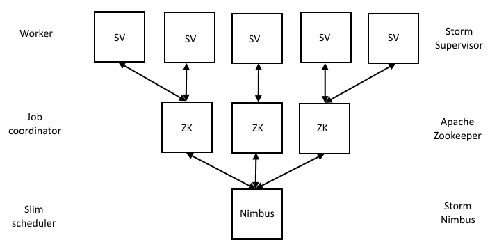
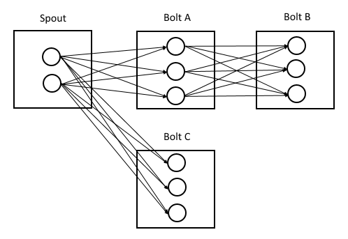

## Description

In the chapter *"Installation: Running in a local cluster mode"* the wordcount example was used. In the this chapter the main code will be explained and then classified. Also other commands for running a storm applicition are presented.

### The WordCountTopology

A storm application is usually packaged in a jar file. This jar file is deployed to a storm cluster or will be run on a local cluster. The following java source code shows a Topology which is instantiated with the TopoloyBuilder class. One spout RandomSentenceSpout is used for input data of random sentences and two bolts to parse and count the words. The bolt SplitSentence is grouped by a shuffle and the bolt WordCount by a field grouping. If there is no special command argument the local cluster mode class is used.

```
TopologyBuilder builder = new TopologyBuilder();

builder.setSpout("spout", new RandomSentenceSpout(), 5);
builder.setBolt("split", new SplitSentence(), 8).shuffleGrouping("spout");
builder.setBolt("count", new WordCount(), 12).fieldsGrouping("split", new Fields("word"));

Config conf = new Config();
conf.setDebug(true);

if (args != null && args.length > 0) {
	conf.setNumWorkers(3);
	StormSubmitter.submitTopology(args[0], conf, builder.createTopology());
}
else {
	conf.setMaxTaskParallelism(3);
	LocalCluster cluster = new LocalCluster();
	cluster.submitTopology("word-count", conf, builder.createTopology());
	Thread.sleep(10000);
	cluster.shutdown();
}
```

### Basic storm structure

Basically a storm application is a topology. When deploying an application in storm there will be a deployment of a topology to storm cluster. Since it is deployed to a productive cluster or used for developing purposes in a local cluster. Next picture illustrates basic components of a storm cluster. Nimbus is small scheduler which assigns tasks to Apache Zookeeper. And Apache Zookeeper coordinates the jobs to supervisor. If nimbus fails and restarts the topology itself runs. In a critical phase a job must be rerun if the local persistance of a worker disrupts. A rerun coordinates again nimbus. 



Following picture show a basic topology which consists of a spout and three bolts. A spout declines a source of data. The data comes in as a stream. Depending on the implementation and using of a grouping of Bolt, Bolts are traversing data coming from a spout. If the last bolt in a processing is reached the result can be put a new output spout. For example in a redis spout. So that a webpage can illustrate the current information inside a value of a redis hashkey. Storm itself does not store any data for long persistance just for temporary uses inside a worker process.



The following list shows default storm groupings:

* Shuffle grouping

* Fields grouping

* All grouping

* Global grouping

* None grouping

* Direct grouping

* Local or shuffle grouping


In the next pixture the first four groupings are illustrated:

