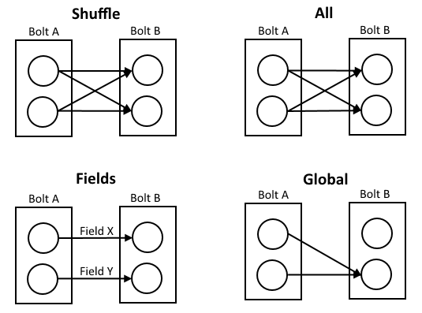

## Description

In the chapter *"Installation: Running in a local cluster mode"* the wordcount example was used. In the next chapters the main code will be explained and then classified. Also other commands for running a storm applicition which is a topology are presented.

### The WordCountTopology

A storm application is usually packaged in a jar file. This jar file is deployed to a storm cluster or will be run on a local cluster. The following java source code shows a Topology which is instanciated with the TopoloyBuilder class. One spout RandomSentenceSpout is used for input data of random sentences and two bolts to parse and count the words. The bold SplitSentence is grouped by shuffle and the bolt WordCount by a FieldsGrouping. If there is no special command argument a LocalCluster class is used.

```
TopologyBuilder builder = new TopologyBuilder();

builder.setSpout("spout", new RandomSentenceSpout(), 5);
builder.setBolt("split", new SplitSentence(), 8).shuffleGrouping("spout");
builder.setBolt("count", new WordCount(), 12).fieldsGrouping("split", new Fields("word"));

Config conf = new Config();
conf.setDebug(true);

if (args != null && args.length > 0) {
	conf.setNumWorkers(3);
	StormSubmitter.submitTopology(args[0], conf, builder.createTopology());
}
else {
	conf.setMaxTaskParallelism(3);
	LocalCluster cluster = new LocalCluster();
	cluster.submitTopology("word-count", conf, builder.createTopology());
	Thread.sleep(10000);
	cluster.shutdown();
}
```

#### Groupings

* Shuffle grouping:

* Fields grouping

* All grouping:

* Global grouping

* None grouping

* Direct grouping

* Local or shuffle grouping


