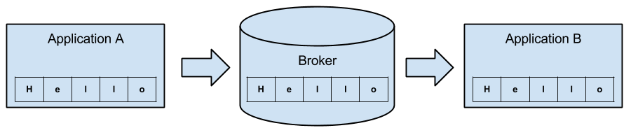

# ZeroMQ

## Introduction
*Message Queuing* is all about connecting two or more endpoints and sending messages between them. Implemented as simple FIFO queues, priority queues or double-ended queues they enable us to communicate asynchronously between loosely-coupled components. 

Especially in large-scaled distributed systems message queuing is widely used. 

But ZeroMQ is not a traditional message queue. It's not like ActiveMQ or RabbitMQ for example. It's brokerless. It has no central broker, no single point of failure. Applications can directly communicate with each other. It is more a library that let us build our own message queuing system.  

But "Zero" not only stands for "zero broker", it also stands for "zero latency", "zero administration", "zero cost" and "zero waste". Summarized ZeroMQ makes it easy to build and maintain applications that communicate fast and without overhead.

ZeroMQ offers us usability features of high-level techniques with speed of low-level approaches, by giving us sockets, based on the BSD sockets, that carry atomic messages across various types of transports.

It gives any application a single socket API to work with, no matter what the actual transport is. (e.g., in-process, inter-process, TCP, or multicast).

ZeroMQ queues messages at both sender and receiver, as needed, and it manages these queues carefully to ensure processes don’t run out of memory, over‐flowing to disk when appropriate. It also automatically reconnects to peers as they come and go. 

### Hello World example

We will demonstrate the basic structure of an ZMQ application with a simple "Hello World" program. It follows the request-reponse pattern and consists of two parts. The first part is the client, which sends a "Hello" to the second part: the server, which replies with "World".  

HelloWorldServer.java:

	import org.zeromq.ZMQ;
	
	public class HelloWorldServer 
	{
	    public static void main(String[] args) throws Exception 
		{
			// creating ZMQ context
	    	ZMQ.Context ctx = ZMQ.context(1);

			// creating ZMQ socket and bind it to port 5555
			ZMQ.Socket responder = context.socket(ZMQ.REP);
			responder.bind("tcp://*:5555");
			
	        while (Thread.currentThread().isInterrupted() == false) 
			{
				// receiving message from a client
				byte[] message = responder.recv(0);
				System.out.println("Received " + new String(message));
	
				// doing some "work"
	            Thread.sleep(1000);

				// replying to the client
				String reply = "World";
				responder.send(reply.getBytes(), 0);
	        }
			
			// closing socket and terminating context
			responder.close();
			ctx.term();
	    }
	}

HelloWorldClient.java:

	//  Hello World client in Java
	
	import org.zeromq.ZMQ;
	
	public class HelloworldClient 
	{
		public static void main(String[] args) 
		{	
			// creating ZMQ context
			ZMQ.Context ctx = ZMQ.context(1);
	
			System.out.println("Connecting to hello world server…");
			
			// creating ZMQ socket and connect it to server	
			ZMQ.Socket requester = ctx.socket(ZMQ.REQ);
			requester.connect("tcp://localhost:5555");
	
			for (int reqNb = 0; reqNb < 10; reqNb++) 
			{
				// creating and sending message to server
		    	String message = "Hello";
				System.out.println("Sending Hello " + reqNb);
				requester.send(message.getBytes(), 0);
				
				// receive reply from server
				byte[] reply = requester.recv(0);
				System.out.println("Received " + new String(reply) + " " + reqNb);
			}

			// closing socket and terminating context
			requester.close();
			ctx.term();
	    }
	}

ZeroMQ applications always start by creating a context `ZMQ.context(1)`, and then using that context for creating a socket `ctx.socket(ZMQ.REQ)`. The context acts as a container for all sockets in a single process. Even though it is technically possible, there should only be exactly one context in your application.

In our example the server binds the socket to port 5555, using tcp routing scheme and starts waiting for requests from the client `responder.bind("tcp://*:5555")`.

The client in turn connects to the server `requester.connect("tcp://localhost:5555")` and starts sending "Hello". 

In this case the server and the client are on the same machine. But as you can see in the code example it would be very easy to connect the client to a server on a different machine just by adjusting IP and port. We will explain the different types of transport and routing schemes in detail in chapter 3 and 4.

HelloWorldClient output:

	Connecting to hello world server
	Sending Hello 0
	Received World 0
	Sending Hello 1
	Received World 1
	Sending Hello 2
	Received World 2
	...
	Sending Hello 9
	Received World 9
