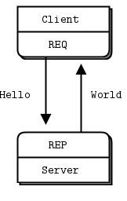
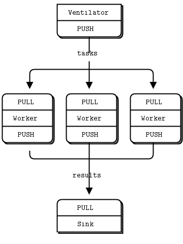

## Description

ZeroMQ is not a traditional message broker. 

It is a concurrency framework, which was build to connect any code to any code anytime. It provides sockets that carry atomic messages across various transport like in-process, inter-process, TCP and multicast.
These "sockets on steriods" are based on the BSD sockets but extending them in various ways (e.g. N:N connections, asynchronous connections, automatic reconnection, ...)

ZeroMQ applications do not depend on any broker. It is not necessary to run a server to deliver a message from one end to another, which eliminates the problem of a single-point of failure.

Any ZeroMQ application starts by creating a *context*, and then using that context for creating sockets. After creating a socket you have to define transport protocol (e.g. tcp, ipc, ...) and a port to specify an endpoint you want to connect to. With this in hand you are ready to send messages (Messages are just Strings / Bytes):

	ZMQ.Socket socket = context.socket(ZMQ.REQ);
	socket.connect("tcp://localhost:555");
	socket.send("Hello World", 0);

### Socket API

* Socket.bind()
* Socket.send()
* Socket.recv()

* I/O backround threads

### Messages

* length-specified binary data
* without trailing 0
* must fit in memory
* ZMQ gurantess to deliver all the parts of a message or none of them
* will send asynchronously, not immediately
* multipart messages are also supported
	* list of frames as single message  
* ZMTP (protocol to read and write frames on a TCP connection)

### Messaging patterns

#### Request - Reply
The reuest-reply pattern connects a set of clients to a set of services. This is a remote procedure call and task distribution pattern.

#### Publish - Subscribe
The publish-subscribe pattern connects a set pf publisher to a set of subscribers. This is a data distribution pattern.

* must set subscription (filter) when you use SUB
* The PUB-SUB socket pair is asynchronous -> subscriber may fail first messages cause it takes some time to connect against the publisher (e.g. cause of tcp handshake) 
* A subscriber can connect to more than one publisher, using one connect call each time. Data will then arrive and be interleaved ("fair-queued") so that no single publisher drowns out the others.
* If a publisher has no connected subscribers, then it will simply drop all messages.
* If using TCP and a subscriber is slow, messages will queue up on the publisher.

#### Pipeline
* parallel processing model
	* ventilator produces tasks that can be done in parallel
	* set of workers that processes tasks
	* sink that collects results back from workers 
* The workers connect upstream to the ventilator, and downstream to the sink.
* We have to synchronize the start of the batch with all workers being up and running.
* The ventilator's PUSH socket distributes tasks to workers evenly (load balancing).
* The sink's PULL socket collects results from workers evenly (fair-queuing).

 

#### Exlusive Pair

* 1:1 relation
* should only be used to connect via IPC

#### Intermediaries and Proxies

##### Dynamic Discovery problem
ZMQ does not come with an message broker. So there is no single server in between, which routes and handles all these messsages. Normally this is a good thing cause all this transport is done in a decentralized way.

But there may be situations in real world, which make it necessary to have some *static* component in the middle of the application. For example if there are a lot of publisher and subscriber and we even want to add more dynamically, it gets harder and harder to remember all subscriber endpoints (protocol, port, maybe IP) to which we have to connect to.

That's why it is possible to add some kind of proxy (similar to a HTTP proxy) in a ZMQ application which acts static component to connect to and simply routes the messages from one endpoint to the new one.

 

##### Shared Queue ... REQ / RES

##### ZMQ builtin proxy function
