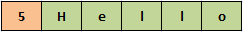
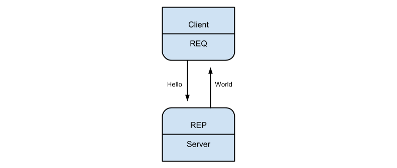
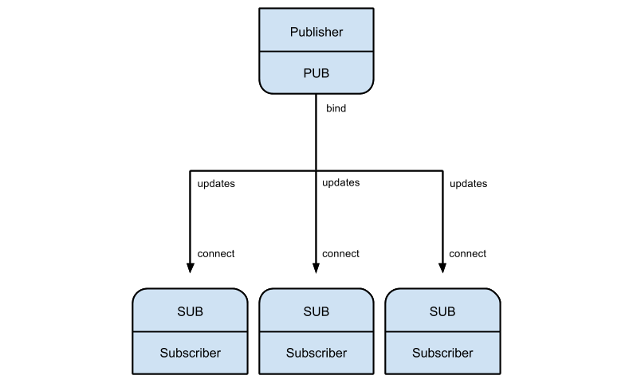
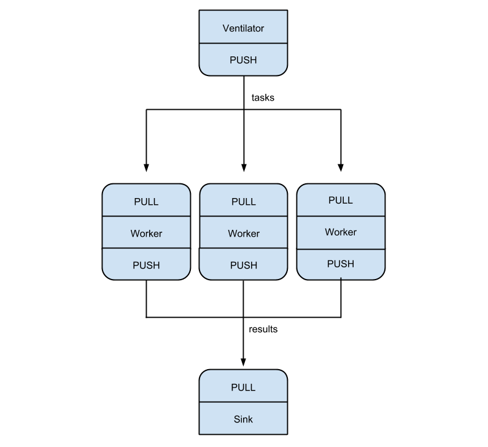

# ZeroMQ

## introduction
*Message Queuing* is all about connecting two or more endpoints and sending messages between them. Implemented as simple FIFO queues, priority queues or double-ended queues they enable us to communicate asynchronously between loosely-coupled components. 

Especially in large-scaled distributed systems message queuing is widely used. 

But ZeroMQ is not a traditional message queue. It's not like ActiveMQ or RabbitMQ for example. It's brokerless. It has no central broker, no single point of failure. Applications can directly communicate with each other. It is more a library that let us build our own message queuing system.  

But "Zero" not only stands for "zero broker", it also stands for "zero latency", "zero administration", "zero cost" and "zero waste". Summarized ZeroMQ makes it easy to build and maintain applications that communicate fast and without overhead.

ZeroMQ offers us usability features of high-level techniques with speed of low-level approaches, by giving us sockets, based on the BSD sockets, that carry atomic messages across various types of transports.

It gives any application a single socket API to work with, no matter what the actual transport is. (e.g., in-process, inter-process, TCP, or multicast).

ZeroMQ queues messages at both sender and receiver, as needed, and it manages these queues carefully to ensure processes don’t run out of memory, over‐flowing to disk when appropriate. It also automatically reconnects to peers as they come and go. 

#### Hello World example

We will demonstrate the basic structure of an ZMQ application with a simple "Hello World" program. It follows the request-reponse pattern and consists of two parts. The first part is the client, which sends a "Hello" to the second part: the server, which replies with "World".  

HelloWorldServer.java:

	import org.zeromq.ZMQ;
	
	public class HelloWorldServer 
	{
	    public static void main(String[] args) throws Exception 
		{
			// creating ZMQ context
	    	ZMQ.Context ctx = ZMQ.context(1);

			// creating ZMQ socket and bind it to port 5555
			ZMQ.Socket responder = context.socket(ZMQ.REP);
			responder.bind("tcp://*:5555");
			
	        while (Thread.currentThread().isInterrupted() == false) 
			{
				// receiving message from a client
				byte[] message = responder.recv(0);
				System.out.println("Received " + new String(message));
	
				// doing some "work"
	            Thread.sleep(1000);

				// replying to the client
				String reply = "World";
				responder.send(reply.getBytes(), 0);
	        }
			
			// closing socket and terminating context
			responder.close();
			ctx.term();
	    }
	}

HelloWorldClient.java:

	//  Hello World client in Java
	
	import org.zeromq.ZMQ;
	
	public class HelloworldClient 
	{
		public static void main(String[] args) 
		{	
			// creating ZMQ context
			ZMQ.Context ctx = ZMQ.context(1);
	
			System.out.println("Connecting to hello world server…");
			
			// creating ZMQ socket and connect it to server	
			ZMQ.Socket requester = ctx.socket(ZMQ.REQ);
			requester.connect("tcp://localhost:5555");
	
			for (int reqNb = 0; reqNb < 10; reqNb++) 
			{
				// creating and sending message to server
		    	String message = "Hello";
				System.out.println("Sending Hello " + reqNb);
				requester.send(message.getBytes(), 0);
				
				// receive reply from server
				byte[] reply = requester.recv(0);
				System.out.println("Received " + new String(reply) + " " + reqNb);
			}

			// closing socket and terminating context
			requester.close();
			ctx.term();
	    }
	}

ZeroMQ applications always start by creating a context `ZMQ.context(1)`, and then using that context for creating a socket `ctx.socket(ZMQ.REQ)`. The context acts as a container for all sockets in a single process. Even though it is technically possible, there should only be exactly one context in your application.

In our example the server binds the socket to port 5555, using tcp routing scheme and starts waiting for requests from the client `responder.bind("tcp://*:5555")`.

The client in turn connects to the server `requester.connect("tcp://localhost:5555")` and starts sending "Hello". 

In this case the server and the client are on the same machine. But as you can see in the code example it would be very easy to connect the client to a server on a different machine just by adjusting IP and port. We will explain the different types of transport and routing schemes in detail in chapter 3 and 4.

HelloWorldClient output:

	Connecting to hello world server
	Sending Hello 0
	Received World 0
	Sending Hello 1
	Received World 1
	Sending Hello 2
	Received World 2
	...
	Sending Hello 9
	Received World 9

## Installation

This chapter will describe how to install and get ZMQ running on Linux and Window systems. 

### Linux
Make sure libtool, autoconf, automake, uuid-dev are installed, otherwise you may have to install them by:

    sudo apt-get install libtool
	sudo apt-get install autoconf
	sudo apt-get install automake
	sudo apt-get install uuid-dev

Also make sure you have C++ Compiler installed, otherwise install it:

	sudo apt-get install build-essential

Then go to Download section on ZeroMQ homepage (http://zeromq.org/area:download) and download the latest stable release. Alternatively you can directly download it into your current path via:

	wget http://download.zeromq.org/zeromq-4.0.3.tar.gz

Afterwards you have to unpack the tarball.

	tar -xvzf zeromq-4.0.3.tar.gz

Then create the make file, build and install the program:

	cd zeromq-4.0.3
	./configure
	make
	sudo make install
	sudo ldconfig

As all of the examples in this book are making use of Java Programming Language it should be installed on your system. If you do not have java installed, you can install it by:

	sudo apt-get install default-jre
	sudo apt-get install default-jdk

### Windows

There are two ways to install ZeroMQ on an Windows system.

#### Installer

Go to "Installers for Microdsoft Windows" page (http://zeromq.org/distro:microsoft-windows), download the latest stable release for your system (x64 or x86) and install it into a directory of your choice.

#### build with Microsoft Visual C++ 2008

First you need Microsoft Visual C++ 2008 or newer installed. 

Then go to download section of ZeroMQ homepage(http://zeromq.org/area:download) and download Windows sources of the latest stable release.

Unpack the .zip source archive and open the solution `buildes\msvc\msvc.sln` in Visual C++ and build it. The ZeroMQ libraries will be in the `lib` subdirectory.

## Sockets

In chapter 1 we were talking about sockets, messages, types of transports, messaging patterns and routing schemes. 

In this chapter we will discuss sockets and messages in more detail to get an better idea of what ZeroMQ really is and what it can do for us.

BSD Sockets are the de facto standard API for performing network programming. They present some kind of synchronous interface to either connection-oriented reliable byte streams (using TCP or SCTP) and connection-less unreliable datagrams (over UDP). 

Besides reliability stream sockets via TCP also ensures sending data sequenced and unduplicated.

Conventional Sockets allow only strict one-to-one and in some cases one-to-many or many-to-one relationships between endpoints, whereas ZMQ sockets allowing many-to-many relationships. Therefore it is possible that a ZMQ socket may be connected to multiple endpoints, sending messages to them and simultaneously accepting incoming connections from multiple different endpoints.

But there are more important differences between conventional sockets and ZMQ sockets. 

ZMQ sockets are asynchronous. Compared to the BSD sockets they are not blocking. The application can hand the message over to ZMQ and process further instead of waiting the message to be send via the socket. ZeroMQ will send the message in background. 

Furthermore it does not matter if there is a destination available right now or not. If not, ZMQ can enqueue the message and send it later when the receiver gets reconnected.

### Socket API

As we saw in the *HelloWorld* example of chapter 1 we need a context to create a socket: `context.socket(3)`. The numeric parameter here is the type of socket. Socket Types will be described in chapter 4 "Messaging Patterns".

#### Socket.bind()

With the `socket.bind(arg)` function it is possible to create an endpoint for accepting connections. The `arg` Parameter is a String consisting of two parts: *transport* and *address* separated by "://".
The *transport* part specifies the underlying transport protocol to use and the *address* part then depends on the transport protocol selected.

The following transports are defined:

- *inproc* - inter-thread communication transport
- *ipc* - inter-process communication transport
- *tcp* - unicast transport using TCP
- *pgm, epgm* - reliable multicast transport using PGM

Example:

	socket.bind("tcp://*:5555");
	socket.bind("ipc:///tmp/data");

#### Socket.connect()

Through `socket.connect(arg)` function we can connect the socket to a specific endpoint, defined by the arg Parameter. As for the `Socket.send()` function the `arg` Parameter is a String consisting of the two parts: *transport* and *address*.

Example:

	socket.connect("tcp://localhost:5555");
	socket.connect("ipc:///tmp/data");

#### Socket.send()

Calling the `socket.send(message, flags)` function instruct ZMQ to enqueue the message to later send it to the specified endpoint. Setting the `ZMQ_SENDMORE` flag indicates that the message is composed of 1 or more message parts. The number of message parts is unlimited and every each part is a independent Socket.send(). The last function call has to be send without the flag to tell ZMQ that this will be the last part of a multiparted message. 

Example:

	// sending a multipart message
	socket.send(messagePart1, ZMQ_SNDMORE);
	socket.send(messagePart2, ZMQ_SNDMORE);
	socket.send(messagePart3, 0);

#### Socket.recv()

`Socket.recv(flag)` shall receive a (multipart) message from the socket and return it as a array of bytes. If there are no messages available on the specified socket the `recv()` function will block. 

Example:

	 byte[] reply = socket.recv(0);

### Messages

As we were talking about messages all the time it would make sense to define what exactly is an message in the context of ZeroMQ. 

Conventional sockets are transferring data as streams of bytes or discrete datagrams, but ZeroMQ transfers messages. 

Messages are length-specified binary data without trailing 0 (not C style). They can be multiparted and must fit in memory. 

ZeroMQ guarantees to deliver all parts of an message or none of them. 

As ZeroMQ does not know anything about the data (except its size) the formatting is completely up to the developer of the application.

## Messaging patterns

Messaging patterns are hard-coded rules, defining how ZeroMQ is routing and queuing messages between the applications. Message patterns are implemented by pairs of sockets and their types.
We will cover the three build-in core ZeroMQ pattern in the following sections.

### Request - Reply Pattern
The request-reply pattern connects a set of clients to a set of services, where a client sends a message to one or more servers and receive a reply for each message sent. The replies to the request have to be strictly in order.
The *HelloWorld* application in chapter 1 one is a typical example for the request-response pattern.

#### Request
A client uses a socket of type `ZMQ_REP` for sending messages to and receiving replies from a server. If the socket is connected to more than one server the messages are sent with the round-robin routing strategy. Sockets of type `ZMQ_REP` does not throw any messages away. If there are no services / server to send the message, all send operations are blocked until a service comes available.  

	ZMQ.Context ctx = ZMQ.context(1);
	ZMQ.Socket request = ctx.socket(ZMQ.REQ);
	request.connect("tcp://localhost:5555");

#### Reply
A server uses a socket of type `ZMQ_REP` to receive messages from and send replies to clients. If the connection between a client and the server is lost, the replied message is thrown away. In case there is more than one client connected the incoming routing strategy is fair-queue. The round-robin scheduling is the simplest way of implementing the fair-queue strategy.

	ZMQ.Context ctx = ZMQ.context(1);
	ZMQ.Socket respond = context.socket(ZMQ.REP);
	respond.bind("tcp://*:5555");

### Publish - Subscribe Pattern
The publish-subscribe pattern a one-to-many model where a publisher sends a message to a set of connected subscribers. This is a one-way data distribution pattern. It is similar to TV broadcasting, where only the viewers who turn on the specific channel are receiving the related information. That means the publisher do not care if there is any subscriber and only connected subscriber are receiving messages, whereas the others will miss them.

#### Publisher
A socket of type `ZMQ_SUB` is used by a publisher to distribute data. A message will be delivered from the publisher to all its connected subscriber (fan-out). If an subscriber is in some kind of exceptional state and cannot receive a message in this moment the message will be dropped. If there is not a single subscriber for the publisher the messages will be simply dropped.

	ZMQ.Context context = ZMQ.context(1);
	ZMQ.Socket publisher = context.socket(ZMQ.PUB);
	publisher.bind("tcp://*:5556");

#### Subscriber
A socket of type `ZMQ_SUB` is used by a subscriber to subscribe to a publisher. A subscriber can conncet to more than one publisher, using one connect call each time. Data will then arrive and be interleaved ("fair-queued") so that no single publisher drowns out the others. One important thing to mention is, that the subscriber has to set a filter while subscribing to a publisher otherwise he will not receive any message. It is possible to set multiple filters.

	ZMQ.Context context = ZMQ.context(1);
	ZMQ.Socket subscriber = context.socket(ZMQ.SUB);
	subscriber.connect("tcp://localhost:5556");
	String filter = "test";
	subscriber.subscribe(filter.getBytes());

### Pipeline Pattern
The pipeline pattern is used for distributing data to nodes arranged in a pipeline. Parallel processing of data can be done using this pattern. 

 

Let's think of a scenario where a node has to process a huge task which can be divided into smaller pieces. The smaller tasks can then be pushed to fast worker nodes, who process these tasks in parallel. At the end every worker then pushes it's result to a collector node.

In this scenario the workers connect upstream to the Ventilator (Producer) Node and downstream to the sink (Collector Node). The tasks will be distributed evenly by the ventilators PUSH socket to the workers (load balancing). The sink's PULL socket collects the results from workers evenly (fair-queuing). 

Here is full code example of the pipeline pattern to demonstrate the usage of `PUSH` and `PULL`sockets and to warp up everything we learned so far:

TaskVentilator.java:

	import java.util.Random;
	import org.zeromq.ZMQ;
	
	public class TaskVentilator 
	{
	    public static void main (String[] args) throws Exception 
		{
	        ZMQ.Context context = ZMQ.context(1);
	
	        //  Socket to send messages to workers
	        ZMQ.Socket workerSocket = context.socket(ZMQ.PUSH);
	        workerSocket.bind("tcp://*:5557");
	
	        //  Initialize random number generator
	        Random r = new Random(System.currentTimeMillis());
	
	        //  Send 100 tasks
	        for (int i = 0; i < 100; i++) 
			{
	            int workload = r.nextInt(100) + 1;
	            String string = String.format("%d", workload);
	            workerSocket.send(string, 0);
	        }
			
			//  Give 0MQ time to deliver
	        Thread.sleep(1000);              
	
	        sink.close();
	        sender.close();
	        context.term();
	    }
	}

TaskWorker.java:

	import org.zeromq.ZMQ;

	public class TaskWorker 
	{
	    public static void main (String[] args) throws Exception 	
		{
	        ZMQ.Context context = ZMQ.context(1);
	
	        //  Socket to receive messages from ventilator
	        ZMQ.Socket ventilatorSocket = context.socket(ZMQ.PULL);
	        ventilatorSocket.connect("tcp://localhost:5557");
	
	        //  Socket to send messages to sink
	        ZMQ.Socket sinkSocket = context.socket(ZMQ.PUSH);
	        sinkSocket.connect("tcp://localhost:5558");
	
	        while (Thread.currentThread ().isInterrupted () == false) 
			{
	            String string = new String(ventilatorSocket.recv(0)).trim();
	            
				long msec = Long.parseLong(string);
	
	            //  Do the 'work'
	            Thread.sleep(msec);
	
	            //  Send results to sink
	            sinkSocket.send("result".getBytes(), 0);
	        }
	        ventilatorSocket.close();
	        sinkSocket.close();
	        context.term();
	    }
	}

TaskSink.java:

	import org.zeromq.ZMQ;
	
	public class TaskSink 
	{
	    public static void main (String[] args) throws Exception 
		{
	        ZMQ.Context context = ZMQ.context(1);

	        ZMQ.Socket workerSocket = context.socket(ZMQ.PULL);
	        workerSocket.bind("tcp://*:5558");
	
	        //  Process 100 results from workers
	        for (int i = 0; i < 100; i++) 
			{
				String result = new String(workerSocket.recv(0)).trim();

				// doing something 'useful' with the result
				System.out.println("result of worker " + i + ": " + result);
	        }
	        receiver.close();
	        context.term();
	    }
	}

## Facts 

<table cellspacing="0" style="border-collapse:collapse;">
 <tr>
  <th>topic</th>
  <th>description</th>
 </tr>
 <tr>
  <td>Software developer</td>
  <td>iMatix Corporation</td>
 </tr>
 <tr>
  <td>Stable release</td>
  <td>4.0.1 (08.10.2013)</td>
 </tr>
 <tr>                                                
  <td>Development status</td> 
  <td>stable/production</td>
 </tr>
 <tr>
  <td>Language</td>
  <td>C, PHP, Python, C++, C#, Java, Delphi, Objective-C, Clojure, ...</td>
 </tr> 
 <tr>
  <td>Operating system</td>
  <td>Linux, Windows, OS X</td>
 </tr>
 <tr>
  <td>Type</td>
  <td>socket library that acts as a concurrency framework</td>
 </tr>
 <tr>
  <td>License</td>
  <td>LGPLv3</td>
 </tr>
 <tr>
  <td>Website</td>
  <td>http://zeromq.org/</td>
 </tr>
</table>													 |

## References

<table>

<tr>
<td><b>[AKGU13]</b></td>
<td>Akgul, Faruk - *ZeroMQ*, U.K., Birmingham, Packt Publishing Ltd., 2013, [Book], ISBN: 978-1-78216-104-2</td>
</tr>

<tr>
<td><b>[HINT13]</b></td>
<td>Hintjens, Peter - *ZeroMQ*, U.S.A., Sebastopol, O'Reilly Media, Inc., 2013, [Book], ISBN: 978-1-449-33406-2</td>
</tr>

<tr>
<td><a href="http://zguide.zeromq.org/page:all" name="RAMQ13"><b>[RAMQ13]</b></a></td>
<td>Hintjens, Peter - *ZeroMQ Documentation*, iMatrix, 2013, [Online], Available: http://zguide.zeromq.org/page:all [Accessed 10 November 2013]</td>
</tr>

</table>

